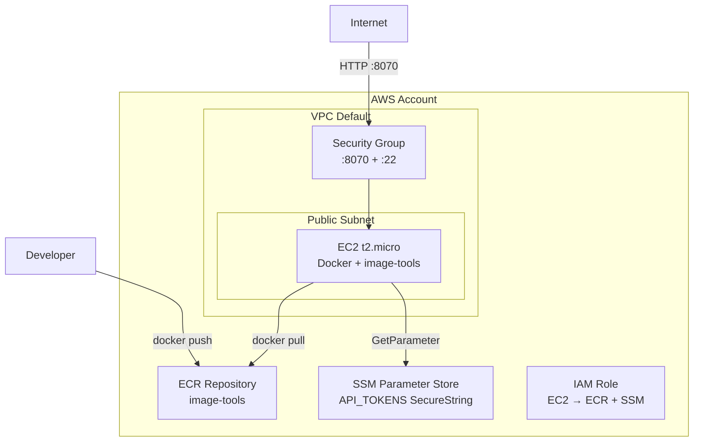
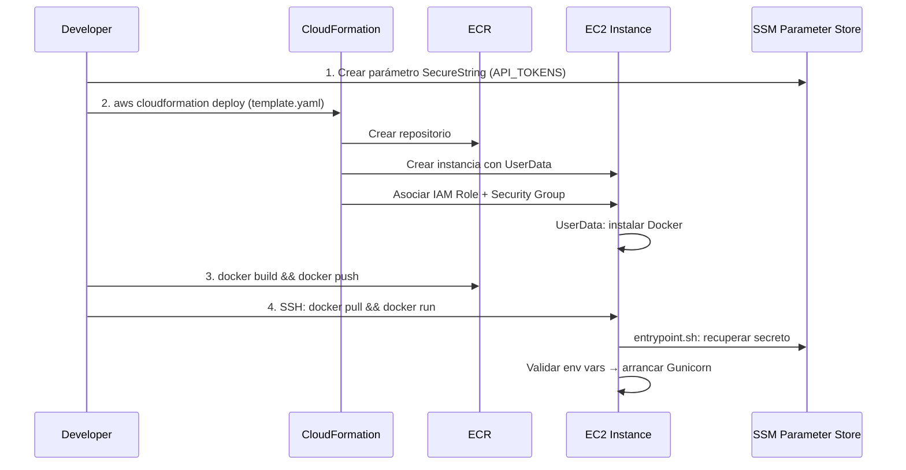

# Design Document: docs-and-aws-deploy

## Overview

Este feature abarca dos áreas principales:

1. **Reestructuración de documentación** — Reorganizar el README.md actual en secciones claras y coherentes, añadiendo documentación de arquitectura, tecnologías y estructura del proyecto. Eliminar placeholders y enlaces irrelevantes.

2. **Configuración de despliegue AWS Free Tier** — Crear una carpeta `aws/` con infraestructura como código (CloudFormation), un script de validación de entorno, documentación comparativa de opciones AWS, y gestión segura de secretos.

### Decisiones clave de diseño

| Decisión | Elección | Justificación |
|----------|----------|---------------|
| Servicio AWS primario | EC2 t2.micro | Único servicio Free Tier con 1GB RAM que soporta Docker y contenedores de 600MB sin restricciones de timeout |
| Herramienta IaC | AWS CloudFormation | Nativa de AWS, sin dependencias externas, formato YAML familiar, integración directa con CLI |
| Gestión de secretos | SSM Parameter Store (SecureString) | Incluido en Free Tier, más simple que Secrets Manager para un solo secreto, integrable con EC2 via IAM |
| Validación de entorno | Shell script (entrypoint.sh) | Se ejecuta antes de Gunicorn, falla rápido si faltan variables, compatible con Docker CMD override |

## Architecture

### Estructura de archivos propuesta

```
aws/
├── README.md                    # Guía paso a paso de despliegue
├── COMPARISON.md                # Documento comparativo de opciones AWS
├── cloudformation/
│   └── template.yaml            # Stack CloudFormation (EC2 + ECR + Security Group + IAM)
├── scripts/
│   └── entrypoint.sh            # Validación de env vars antes de arranque
└── env.example                  # Ejemplo de variables (sin valores reales)
```

### Diagrama de despliegue AWS



### Flujo de despliegue



## Components and Interfaces

### 1. CloudFormation Template (`aws/cloudformation/template.yaml`)

**Responsabilidad**: Definir toda la infraestructura necesaria como un stack desplegable.

**Recursos creados**:
- `AWS::ECR::Repository` — Repositorio para la imagen Docker
- `AWS::EC2::SecurityGroup` — Puertos 8070 (HTTP) y 22 (SSH)
- `AWS::IAM::Role` + `AWS::IAM::InstanceProfile` — Permisos para ECR pull y SSM read
- `AWS::EC2::Instance` — t2.micro con Amazon Linux 2023, Docker instalado via UserData

**Parámetros de entrada**:
- `Environment` (String, default: "production")
- `ApiGlobalPrefix` (String, default: "/api/v1")
- `MaxUploadMb` (String, default: "10")
- `ValidateHttpsUrl` (String, default: "true")
- `LogLevel` (String, default: "INFO")
- `KeyPairName` (String) — Para acceso SSH
- `ApiTokensParameterName` (String, default: "/image-tools/api-tokens") — Nombre del parámetro SSM

**Outputs**:
- `InstancePublicIp` — IP pública de la instancia
- `EcrRepositoryUri` — URI del repositorio ECR
- `ServiceUrl` — URL completa del health endpoint

### 2. Entrypoint Script (`aws/scripts/entrypoint.sh`)

**Responsabilidad**: Validar que todas las variables de entorno requeridas están definidas y no vacías antes de iniciar el servidor.

**Interfaz**:
- **Entrada**: Variables de entorno del sistema
- **Salida**: Éxito (exec Gunicorn) o fallo (exit 1 con mensaje de error)

**Variables validadas**:
| Variable | Tipo | Fuente |
|----------|------|--------|
| `ENVIRONMENT` | No sensible | Variable de entorno directa |
| `IMAGE_TOOLS_API_TOKENS` | Sensible | SSM Parameter Store → inyectada al contenedor |
| `IMAGE_TOOLS_API_GLOBAL_PREFIX` | No sensible | Variable de entorno directa |
| `MAX_UPLOAD_MB` | No sensible | Variable de entorno directa |
| `IMAGE_PROCESS_VALIDATE_HTTPS_URL` | No sensible | Variable de entorno directa |
| `LOG_LEVEL` | No sensible | Variable de entorno directa |

**Comportamiento**:
1. Iterar sobre lista de variables requeridas
2. Para cada variable: verificar que existe Y no está vacía
3. Si falla alguna: imprimir `ERROR: Required environment variable '<NAME>' is not set or empty` a stderr y salir con código 1
4. Si todas pasan: ejecutar `exec gunicorn ...` (reemplaza el proceso shell)

### 3. Documento comparativo (`aws/COMPARISON.md`)

**Responsabilidad**: Documentar el análisis de opciones AWS Free Tier para este servicio.

**Contenido**:
- Tabla de restricciones del servicio (600MB imagen, 176MB modelo, 512MB-2GB RAM)
- Evaluación de EC2 t2.micro, Lambda (container), App Runner, ECS Fargate, Lightsail
- Tabla resumen con viabilidad y recomendación
- Opciones excluidas con justificación

### 4. README.md del proyecto (reestructurado)

**Responsabilidad**: Documentación principal del proyecto con estructura jerárquica clara.

**Secciones principales (H2)**:
1. Arquitectura
2. Tecnologías
3. Estructura del proyecto
4. Construir y ejecutar (Local, Docker, Docker Compose, Kubernetes, AWS)
5. Endpoints disponibles
6. Uso de la API (curl, .http, Swagger)
7. Endpoint image-process (documentación detallada)
8. Tests

## Data Models

### CloudFormation Parameters Schema

```yaml
Parameters:
  Environment:
    Type: String
    Default: "production"
    AllowedValues: ["production", "staging", "development"]
  KeyPairName:
    Type: AWS::EC2::KeyPair::KeyName
    Description: "EC2 Key Pair para acceso SSH"
  ApiGlobalPrefix:
    Type: String
    Default: "/api/v1"
  MaxUploadMb:
    Type: String
    Default: "10"
  ValidateHttpsUrl:
    Type: String
    Default: "true"
    AllowedValues: ["true", "false"]
  LogLevel:
    Type: String
    Default: "INFO"
    AllowedValues: ["DEBUG", "INFO", "WARNING", "ERROR", "CRITICAL"]
  ApiTokensParameterName:
    Type: String
    Default: "/image-tools/api-tokens"
    Description: "Nombre del parámetro SSM SecureString con los API tokens"
```

### Environment Variables Map

```
┌─────────────────────────────────────┬─────────────┬──────────────────────────┐
│ Variable                            │ Clasificación│ Almacenamiento           │
├─────────────────────────────────────┼─────────────┼──────────────────────────┤
│ ENVIRONMENT                         │ No sensible │ CloudFormation Parameter │
│ IMAGE_TOOLS_API_TOKENS              │ Sensible    │ SSM SecureString         │
│ IMAGE_TOOLS_API_GLOBAL_PREFIX       │ No sensible │ CloudFormation Parameter │
│ MAX_UPLOAD_MB                       │ No sensible │ CloudFormation Parameter │
│ IMAGE_PROCESS_VALIDATE_HTTPS_URL    │ No sensible │ CloudFormation Parameter │
│ LOG_LEVEL                           │ No sensible │ CloudFormation Parameter │
└─────────────────────────────────────┴─────────────┴──────────────────────────┘
```

### AWS Options Comparison Data Model

| Servicio | RAM disponible | Almacenamiento | Free Tier | Cold Start | Viable |
|----------|---------------|----------------|-----------|------------|--------|
| EC2 t2.micro | 1 GB | 8 GB EBS | 750 h/mes (12 meses) | N/A (always running) | ✅ Alta |
| Lambda (container) | Hasta 10 GB | 10 GB image | 1M req + 400K GB-sec | 30-120s | ⚠️ Media |
| App Runner | Configurable | Efímero | No free tier | 5-30s | ❌ Sin free tier |
| ECS Fargate | Configurable (min 512MB) | Efímero | No free tier | 10-30s | ❌ Sin free tier |
| Lightsail | 512 MB (plan $3.50) | 20 GB SSD | No free tier | N/A | ❌ Sin free tier |

## Error Handling

### Entrypoint Script - Estrategia de errores

| Escenario | Comportamiento | Código de salida |
|-----------|----------------|------------------|
| Variable requerida no definida | Log error con nombre de variable, NO iniciar Gunicorn | 1 |
| Variable requerida vacía (`""`) | Log error con nombre de variable, NO iniciar Gunicorn | 1 |
| Fallo al recuperar secreto de SSM | Log error indicando falla de acceso sin exponer valor | 1 |
| Todas las variables presentes | Exec Gunicorn (reemplaza proceso shell) | 0 (delegado a Gunicorn) |

**Formato de mensajes de error**:
```
[ENTRYPOINT] ERROR: Required environment variable 'VARIABLE_NAME' is not set or empty
[ENTRYPOINT] ERROR: Failed to retrieve secret from SSM Parameter Store. Check IAM permissions and parameter existence.
```

**Notas de implementación**:
- El script NO aplica valores por defecto — si una variable falta, el contenedor no arranca
- Los errores van a stderr para que Docker/CloudWatch los capture
- El script nunca imprime el valor del secreto, solo su nombre

### CloudFormation - Estrategia de errores

| Escenario | Comportamiento |
|-----------|----------------|
| KeyPair no existe | CloudFormation falla con error claro antes de crear recursos |
| Parámetro SSM no existe | El contenedor falla al iniciar (entrypoint.sh detecta variable vacía) |
| Quota excedida (EC2) | CloudFormation falla y hace rollback automático |
| VPC default no existe | Documentar en README cómo crear VPC default o especificar VPC/Subnet |

### Docker Health Check

El contenedor configura un health check contra `/health` con:
- `interval`: 30s
- `timeout`: 10s
- `retries`: 3
- `start-period`: 120s (tiempo para que el modelo U2NET se cargue)

Si el health check falla 3 veces consecutivas, Docker marca el contenedor como unhealthy.

## Testing Strategy

### Justificación de NO usar Property-Based Testing

Este feature NO es adecuado para property-based testing por las siguientes razones:

1. **Documentación (Requirements 1-4)**: Son archivos markdown estáticos. No hay funciones con input/output variable que testear.
2. **CloudFormation template (Requirement 6)**: Es IaC declarativa. Se valida con `aws cloudformation validate-template` y deployment tests, no con PBT.
3. **Documento comparativo (Requirement 5)**: Es contenido estático de análisis. No es ejecutable.
4. **Entrypoint script (Requirement 7)**: Es un shell script simple con lógica booleana (variable existe/no existe). Example-based tests son suficientes y más apropiados.
5. **Gestión de secretos (Requirement 7.2)**: Es configuración de IAM/SSM, no lógica de aplicación.

### Estrategia de testing aplicable

#### 1. Validación de CloudFormation Template

- **Herramienta**: `aws cloudformation validate-template`
- **Qué verifica**: Sintaxis YAML válida, referencias entre recursos correctas, tipos de parámetros válidos
- **Cuándo ejecutar**: Pre-commit o CI

```bash
aws cloudformation validate-template --template-body file://aws/cloudformation/template.yaml
```

#### 2. Tests del Entrypoint Script (Example-Based)

- **Herramienta**: Shell script de test o framework como `bats-core`
- **Casos a cubrir**:
  - Todas las variables presentes → éxito (exit 0, exec gunicorn)
  - Una variable faltante → fallo (exit 1, mensaje identifica variable)
  - Variable vacía (`""`) → fallo (exit 1, mensaje identifica variable)
  - Múltiples variables faltantes → fallo (exit 1, mensajes para cada una)
  - Secreto SSM inaccesible → fallo (exit 1, mensaje genérico sin valor)

#### 3. Smoke Test post-despliegue

- **Qué verifica**: El stack está completo y el servicio responde
- **Cómo**:
```bash
# Obtener IP del output de CloudFormation
IP=$(aws cloudformation describe-stacks --stack-name image-tools --query 'Stacks[0].Outputs[?OutputKey==`InstancePublicIp`].OutputValue' --output text)

# Verificar health endpoint
curl -f http://$IP:8070/health
```

#### 4. Validación de documentación

- **Herramienta**: Revisión manual + linting markdown (markdownlint)
- **Qué verifica**: Estructura de encabezados correcta, links válidos, sin placeholders residuales
- **Cuándo ejecutar**: PR review

#### 5. Integration Test (despliegue completo)

- **Qué verifica**: El flujo completo desde `cloudformation deploy` hasta health check exitoso
- **Duración estimada**: 3-5 minutos
- **Cuándo ejecutar**: Manualmente antes de documentar como "verificado"
